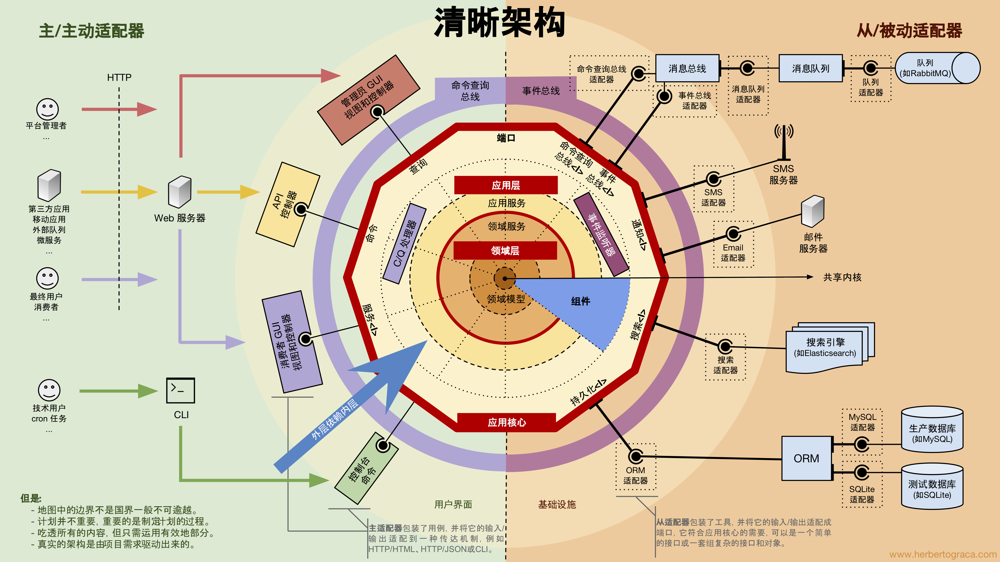

# Spring Library

这是一个图书借阅管理系统，市民可以自由借阅和归还图书，并自行更改借阅与归还的状态。

市民可以注册自己的账户并查看图书的相关信息，他们可以借书和还书。

假设每位市民都是负责任的，会妥善保管图书，并且他们不会借了书而不执行借书登记操作。

## 安装要求 

服务端:

- Java: 17+ LTS
- Spring Boot: 3.2.5
- Domain Driven Design

客户端:

- Vue: https://vuejs.org/
- ElementUI: https://github.com/element-plus/element-plus
- TypeScript: https://www.typescriptlang.org/

## 运行项目

    $ ./mvnw install && ./mvnw spring-boot:run --projects com.origin:library
    $ ./mvnw install && ./mvnw spring-boot:run --projects com.origin:hello

## 项目结构

### 单模块服务端

- domain
  - error
  - success
- infrastructure
  - jwt
  - repository
  - util
  - ...
- port
  - control

### 多模块服务端

- Application.java
- shared
  - domain
  - infrastructure
    - bus
      - EventDispatcher.java
    - sms
    - email
    - search
    - orm
    - jwt
    - util
    - ...
  - port 
    - control
- module1
  - domain
  - infrastructure
    - DepartmentRepository.java
  - port 
- module2
  - domain
    - event
      - UserAdded.java
      - UserRemoved.java
      - UserEdited.java
      - UserLogined.java
    - User.java
    - UserService.java
    - Book.java
    - BookService.java
    - UserBookService.java
  - infrastructure
    - UserRepository.java
    - BookRepository.java
  - port
    - restful
      - CommandQuery.java
      - UserController.java
      - UserService.java
      - BookController.java
      - BookService.java
      - OtherService.java
      - view
        - user.html
        - book.html
    - console
      - UserController.java
      - UserService.java
    - listener
      - UserConsumer.java
  

### 清晰架构

说明：

1. 公共的文件，放到shared下面。
1. 子模块只有一个，直接往上提一层，避免目录过深，参考`DepartmentRepository.java`和`restful`。
1. 使用类代替单一实现的接口，避免过度设计，自有项目简洁性和可读性大于外部项目的可扩展性。
1. 类的命名需要直接代表其含义，减少必要的后缀，比如不能在名称后面添加DTO、VO。
1. 只有包外需要引用的类，才能设置成公开可见，包内可见的同一类别的类，全部放置到同一个文件中。
1. module2是完整的基于清晰架构的项目结构，大型项目可以直接参照该架构进行代码组织。
1. 外层目录只能有domain、infrastructure、port三个目录。
1. domain目录是领域层，包含领域模型、领域服务、领域事件、领域错误。
1. 领域模型必须由唯一的ID，而且不能是组合ID，可以是字符串或数字。
1. 领域模型可以是数据库实体，实体也可以放置到仓库中，然后转换后由仓库输入或输出领域模型。
1. 领域模型的切片或组合也放置到domain目录中，这种类也叫做数据传输对象（DTO）。
1. 领域服务通常是在内存中操作领域模型，但大型项目为了提高代码复用度，也可以引入仓库等基础设施的适配器。
1. 领域错误使用Error代替Exception，以便和系统错误区分，另外，基础设施中不要引入领域错误。
1. infrastructure目录是基础设施层，包含仓库、事件总线、发送事件、短信、邮件、搜索、三方服务等。
1. infrastructure目录中也可以放置一些公用类目录，比如util，代表基础设施的一部分。
1. infrastructure中直接实现适配器，如果是单一接口实现，适配器使用类代替接口。
1. port目录是用户界面层，包括restful端口、控制台端口、事件监听端口。
1. port.control或restful.control代表对应用的控制，包含拦截器、日志、身份验证等。
1. port中放置应用服务，以减少架构的分层层数，以保持架构的简洁性。
1. port中的命令和查询直接写在`CommandQuery.java`文件，使用Handler层代替AppService层以保持架构简洁性。
1. Application.java文件中实现对项目的配置、依赖的解决、端口的组合、项目的启动等。

## 代码提交规范

1. 单次提交的内容是方便Code Review的。
2. 单次提交的代码，需要是代码格式化后的，方便阅读的。
3. 有效使用.gitignore文件，不能提交无用文件到代码仓库。
4. 单次提交的message，需遵守Angular提交规范，使用如"feat(docs): content"的格式。
5. 单次提交使用Git提交检查工具进行强制检测，如使用commitlint、husky等。

## Java命名规范

1. 基础规范
    - 所有命名使用有意义的、清晰描述性的英文单词。
    - 杜绝过长，确保名称易于理解和记忆。
    - 按场景选择使用驼峰式（CamelCase）、蛇形（snake_case）或串式（kebab-case）命名。
    - 文件放置使用紧凑模式，必要时用类型后缀进行区分，如UserController、UserService等。
    - 目录下是单一的类别时，避免不必要的后缀，例如使用 `model.User` 而非 `UserModel`。
2. 变量命名
    - 均使用小驼峰法（camelCase）。
    - 使用复数代替类型后缀，如使用users代替userList。
3. 常量命名
    - 全部使用蛇形命名法（snake_case），全部大写。
    - 如 `MAX_SIZE`, `DEFAULT_COLOR`。
4. 枚举命名
    - 通常使用蛇形命名法（snake_case），全部大写。
    - 如 `STATUS_ACTIVE`, `STATUS_INACTIVE`。
5. 类命名
    - 使用大驼峰法（PascalCase）。
    - 类名应明确反映其功能，如 `User`, `NetworkUtil`。
6. 方法命名
    - 使用小驼峰法（camelCase）。
    - 方法名应清楚描述其功能，如 `calculateTotal`, `setUsername`。
7. 接口
    - 使用大驼峰法（PascalCase）。
    - 不添加多余的标识，如使用`UserManagement`代替`IUserManagement`。
    - 若接口只有一个实现，此时直接使用类替代接口，避免接口滥用。
8. 控制器方法
    - 使用小驼峰法。
    - 使用add、remove、edit、find、search代替get、gets、post、update、delete等。
    - 方法后面应添加实体类型，如addUser、findUser等。
9. 仓库类方法
    - 使用小驼峰法。
    - 使用JPA时需准守JPA的命名规范。
10. 服务类
    - 使用大驼峰法。
    - 确保服务名称清晰表明其功能，如 `BillingService`, `UserAuthenticationService`。
11. 目录命名
    - 使用串式命名法（kebab-case），如 `assets-images`，`config-data`。
    - 目录使用单数替代复数，需一直保持统一。
12. 数据库命名
    - 使用蛇形命名法（snake_case），小写。
    - 表名使用复数，如 `user_accounts`, `order_details`。
    - 字段名通常使用单数，代表多个时需使用复数，如`departments`。
13. API字段命名
    - 上下行数据字段使用小驼峰法（camelCase），如 `firstName`, `orderNumber`。
    - 遵守Restful规范，合理使用POST、GET、PUT、PATCH、DELETE等。
    - 接口路径应使用复数，如"POST /api/users"。
15. 测试用例命名
    - 测试方法名使用小驼峰法，并应体现测试目的，如 `testConnectionShouldFailIfTimeout`。

## 参考资料

- https://github.com/christophknabe/spring-ddd-bank
- https://github.com/spring-projects/spring-petclinic
- https://github.com/ali-bouali/spring-boot-3-jwt-security
- https://github.com/kailong321200875/vue-element-plus-admin
- https://www.conventionalcommits.org/en/v1.0.0-beta.4/
- https://github.com/ZJDoc/GitGuide
- https://typicode.github.io/husky/get-started.html
